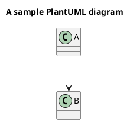

# Documentation

Use the navigation on the left to access the documents for the different entities.

## Plant Uml

```plantuml
@startuml
title
A sample PlantUML diagram
end title

class A
class B

A --> B
@enduml
```

With some math

$y = a x + b$

\[y^2 = a x + b\]
