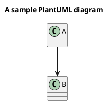

# Documentation

Use the navigation on the left to access the documents for the different entities.

## Plant Uml

## Math

With some math

Inlining one simple expression ($ sign): $y = a x + b$ with trailing text

Inlining second one ($ sign): $p(x|y) = \frac{p(y|x)p(x)}{p(y)}$ with trailing text

* Inlining third one (paren): \(p(x|y) = \frac{p(y|x)p(x)}{p(y)}\) with trailing text

## Stand alone

Some stand alone formula:

$$
y^2 = a x + b
$$

Should be rendered above this line.
